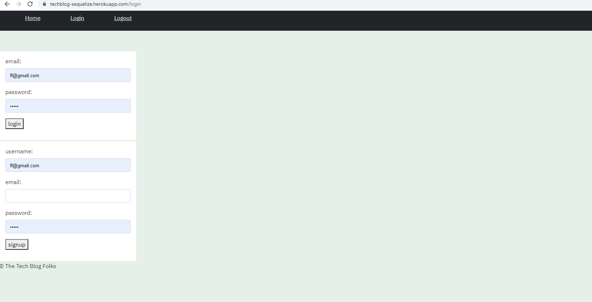
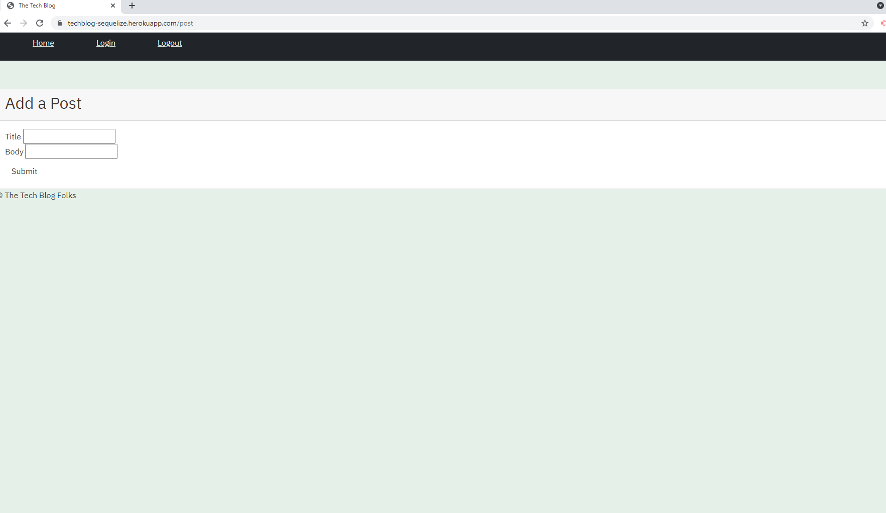

# Tech-Blog-
## description
This is a tech blog that allows a user to post about whatever they wish. It supports account creation with secure password hashing and storage as well as the ability to login. Users can view all posts, or go to their dashboards to see the posts they have made. They can also comment on posts if they are logged in. If the user idles for too long they will be logged out of their accountAS A developer who writes about tech I WANT a CMS-style blog sit SO THAT I can publish articles, blog posts, and my thoughts and opinion
## Screenshots

## Live Site
[Tech Blog](https://techblog-sequelize.herokuapp.com/)
